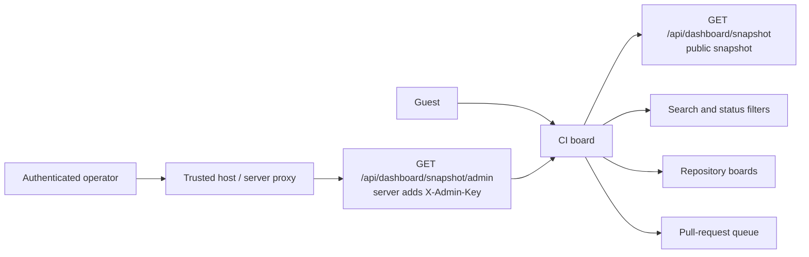

# CI Frontend Audit — 2026-07-16

> Audit of `FixPortal/fixportal-ci-frontend` at `4553f10`, exercised against the
> public FixPortal CI snapshot API on 2026-07-16. Evidence covers the standalone
> guest dashboard at desktop and mobile widths; admin-only behaviour is assessed
> from tests and the frontend/backend contract where authentication is required.

## Executive summary

The dashboard remains sound on its primary desktop guest path and all seven
findings from the initial audit are now remediated. The changes are deliberately
contained: responsive CSS applies at 720px and below, while a committed 1280 ×
800 Playwright baseline guards the steady-state desktop composition.

The fresh gate passes 32 test files and 137 tests, library/app typechecks and
builds, four Chromium regressions, actionlint, and a production dependency
audit. The production container also passes `nginx -t`, serves the agreed
security headers, and proxies the live public snapshot successfully.

| Severity | Count | Release implication |
|---|---:|---|
| Critical | 0 | None |
| High | 0 | None |
| Medium | 0 open / 4 closed | Remediated and regression-tested |
| Low | 0 open / 3 closed | Remediated and regression-tested |
| **Total** | **0 open / 7 closed** | **Ready for normal review and CI** |

## What is working well

| Area | Evidence |
|---|---|
| Automated quality | 32 test files and 137 tests pass; library/app typechecks and builds pass |
| Browser regression | Phone containment, cold-load CLS, loading geometry and desktop rendering pass in Chromium |
| Dependency baseline | `npm audit --omit=dev` reports zero production vulnerabilities |
| Public confidentiality | The backend serves a distinct public snapshot and strips private repositories server-side |
| Guest workflows | Search, status/PR filters, clear-filter recovery, collapse, legend and theme controls work |
| State persistence | Search/filter and theme state survive reload without breaking guest visibility |
| Accessibility fundamentals | Native controls, labelled status images, pressed states, native modal focus trapping and focus return are present |
| Visual craft | Desktop hierarchy is clear and consistent in both light and dark themes |

## Product flow



## Findings

### CI-UI-001 — Mobile toolbar forces horizontal scrolling

| Field | Value |
|---|---|
| Severity | Medium |
| Category | Responsive layout / usability |
| Surface | Guest dashboard at 390 × 844 CSS pixels |
| Evidence | [Annotated mobile screenshot](screenshots/guest-mobile.png) |

The standalone app does not establish `border-box`, so `.dashboard-page` is
`width: 100%` plus 48px of horizontal padding under the default content-box
model. The filter row also remains a single flex line while its status chips and
board controls need more width than a phone provides. Together they create a
horizontal scrollbar, clip the refreshed timestamp and collapse control, and
require sideways scrolling before the repository content can be read. The
summary cards correctly stack, so this is not an intentional desktop-only
layout.

Reproduction:

1. Open the guest dashboard at `http://localhost:5173`.
2. Set the viewport to 390 × 844 CSS pixels.
3. Observe the horizontal scrollbar and clipped controls in the annotated
   screenshot.

Expected: the sticky controls wrap or reflow within the viewport and the page
has no horizontal document scroll.

#### Closure — remediated

- **Commits:** `d5853ed`, `3cf3535`
- **Change:** mobile-only border-box sizing and control reflow, plus a
  shrinkable three-column CI summary grid. Desktop rules above 720px are
  unchanged.
- **Proof:** Playwright models the 15px Windows scrollbar gutter and asserts
  document `scrollWidth <= clientWidth`; the production container measured
  `375 = 375` inside a 390px browser window.
- **Evidence:** [390 × 844 after remediation](screenshots/after-mobile-390x844.png)

### CI-UI-002 — Snapshot failure state gives operators no recovery cue

| Field | Value |
|---|---|
| Severity | Low |
| Category | Error-state UX |
| Surface | Guest dashboard when the snapshot request fails |
| Evidence | [Annotated failure screenshot](screenshots/snapshot-error.png) |

After the built-in query retry is exhausted, the entire operational surface is
replaced by `Dashboard unavailable.` There is no visible retry action, last
successful refresh context, cause category, or indication that polling will
continue automatically. The branch is technically safe and does retry in the
background every 30 seconds, but the interface does not tell the operator that
recovery is automatic.

Reproduction:

1. Abort `GET /api/dashboard/snapshot` before loading the dashboard.
2. Reload and wait for the configured retry to finish.
3. Observe the single-line failure state.

Expected: retain useful last-known context where available and state the
recovery behaviour, with an explicit retry control for immediate recovery.

#### Closure — remediated

- **Commits:** `3e4634e`, `b802a94`
- **Change:** first-load failure now explains automatic retry and offers
  `Retry now`; background failure preserves cached data and shows a muted
  `refresh failed · retrying` status.
- **Proof:** `CiBoardContent.states.test.tsx` covers both branches and the manual
  refetch call.
- **Evidence:** [first-load retry](screenshots/after-error-retry.png),
  [cached-data warning](screenshots/after-cached-refresh-warning.png)

### CI-UI-003 — Standalone `admin=true` enables controls without an admin data source

| Field | Value |
|---|---|
| Severity | Medium |
| Category | Functional / role-state consistency |
| Surface | Standalone dashboard at `?admin=true` |
| Evidence | [Annotated role mismatch screenshot](screenshots/standalone-admin-guest-mismatch.png) |

The standalone app persists `?admin=true` as `adminSignal`, which exposes the
Public/Private visibility filters and makes the open-PR summary interactive.
However, the app passes neither `adminSnapshotUrl` nor `adminSnapshotFetcher`,
so `useDashboardSnapshot` still requests the anonymous public endpoint. The
header correctly says `[Guest]`, while the body presents administrator-only
controls. Selecting Private predictably produces `0 of 8 repositories` because
the server has already stripped every private repository.

This does not leak private data—the backend correctly keeps `/snapshot/admin`
behind a server-held `X-Admin-Key`—but it creates a role state the standalone
application cannot fulfil.

Reproduction:

1. Open `http://localhost:5173/?admin=true` using the standard standalone app.
2. Observe `[Guest]` in the header alongside the Visibility controls.
3. Select Private and observe an empty result against the public snapshot.

Expected: only expose admin controls when a privileged source is configured.
For a standalone deployment, that requires a same-origin server proxy that adds
the admin key; the browser must never receive the key itself.

#### Closure — remediated

- **Commit:** `4aa970c`
- **Change:** one `effectiveAdmin` value now drives both the descriptor and the
  admin context; it requires the host signal and a privileged URL/fetcher.
- **Proof:** component tests cover guest-without-source and admin-with-source;
  the standalone `?admin=true` walkthrough reported zero Visibility fieldsets.
- **Evidence:** [standalone query remains guest-only](screenshots/after-admin-query-guest-only.png)

### CI-ARCH-004 — Exported snapshot type has drifted from the backend contract

| Field | Value |
|---|---|
| Severity | Low |
| Category | Contract correctness / maintainability |
| Surface | Published `DashboardSnapshot` TypeScript API |
| Evidence | Live endpoint keys and backend records compared on 2026-07-16 |

The exported TypeScript types omit fields that the backend record and live
payload expose: `WorkflowRun.repository`, `WorkflowRun.workflowFile`,
`RepositorySnapshot.lastMergedPr`, `CiTrendBucket.isBackfilled`, and
`DashboardSnapshot.publicCiTrend`. They also declare `deploys` and `packages`
as always-present arrays while the backend contract makes both nullable.

The current board does not crash because every nullable collection use is
defensively coalesced and unknown JSON fields are ignored. The drift matters to
library consumers, though: the README calls this the full exported shape, and a
consumer compiling against it cannot use fields that are present on the wire or
see the backend's nullability.

Expected: generate or parity-test the TypeScript contract from a committed
backend schema/snapshot, then either expose the complete DTO or explicitly
publish a named frontend projection rather than presenting it as the wire shape.

#### Closure — remediated

- **Commit:** `65f8812`
- **Change:** the exported types now include the backend's run, repository and
  trend fields and match nullable collections/trends.
- **Proof:** `types.contract.test.ts` is included by the strict library
  typecheck and represents the backend JSON shape, including null collections.

### CI-PERF-005 — Initial snapshot render produces a very poor layout-shift score

| Field | Value |
|---|---|
| Severity | Medium |
| Category | Performance / visual stability |
| Surface | Initial guest dashboard load |
| Evidence | Two clean page-load profiles: CLS `0.82` and `0.82` |

The dashboard's initial loading branch is a short message, followed by the full
multi-panel board when the snapshot arrives. Two repeat runs with the browser's
Core Web Vitals profiler both recorded cumulative layout shift of `0.82`; the
usual poor threshold starts at `0.25`. TTFB, FCP and LCP were fast locally, so
the instability—not network or render time—is the material performance issue.

The likely shift is the compact loading `main` allowing the footer into the
initial viewport before the complete board displaces it. Confirm the individual
shift sources in a production trace, then reserve the dashboard's first-view
geometry with a representative skeleton or minimum-height shell. Do not hide the
symptom with a fixed full-page height that makes genuine empty/error states
awkward.

#### Closure — remediated

- **Commit:** `d5853ed`
- **Change:** a lightweight three-panel loading skeleton reserves the first
  viewport. Loading and loaded roots have distinct React keys so reconciliation
  cannot reuse and move the skeleton node as board content.
- **Proof:** the cold-load Playwright gate passes at CLS `<= 0.10`; the loading
  shell height gate and the 1280 × 800 desktop baseline also pass.
- **Evidence:** [loading skeleton](screenshots/after-loading-skeleton.png)

### CI-SEC-006 — Default container omits browser hardening headers

| Field | Value |
|---|---|
| Severity | Low |
| Category | Deployment security hardening |
| Surface | Standalone nginx image |
| Evidence | `nginx.conf.template` at `4553f10` |

The shipped nginx configuration proxies `/api/` and serves the SPA, but adds no
Content Security Policy, `X-Content-Type-Options`, referrer policy, permissions
policy, or framing restriction. An upstream gateway may add these in a specific
deployment, but consumers running the documented Docker command receive the
image's defaults.

Expected: add a conservative standalone-app header baseline. Because API calls
are same-origin through `/api/`, the CSP can normally keep `default-src` and
`connect-src` at `'self'`; validate Vite's emitted module/style requirements and
place HSTS at the TLS-terminating layer rather than blindly adding it to the
plain HTTP container.

#### Closure — remediated

- **Commit:** `1e1cc8f`
- **Change:** nginx now emits CSP, `nosniff`, strict-origin referrer policy and
  a restrictive permissions policy with `always`; framing is denied by CSP.
  HSTS remains at the upstream TLS boundary.
- **Proof:** the rebuilt image passes `nginx -t`; `HEAD /` returns all four
  headers and `GET /api/dashboard/snapshot` returns HTTP 200 through the proxy.

### CI-CI-007 — Publish-capable workflows execute mutable tool/action versions

| Field | Value |
|---|---|
| Severity | Medium |
| Category | CI supply chain / reproducibility |
| Surface | `.github/workflows/ci.yml`, `release.yml`, `mutation.yml` |
| Evidence | Workflow definitions at `4553f10` |

The workflows reference actions by mutable major tags, including third-party
Blacksmith build actions in the job with `packages: write`. The npm release job
also runs `npm install -g npm@latest` immediately before publishing with OIDC.
That makes the release toolchain change between identical tags and expands the
trust placed in mutable references during privileged jobs.

Expected: pin every action to a reviewed full commit SHA (retaining the version
as a comment for maintainability) and pin npm to an intentional tested version.
Use Dependabot or Renovate to make upgrades explicit and reviewable.

#### Closure — remediated

- **Commit:** `4d58ac1`
- **Change:** every action is full-SHA pinned, workflows use Node 24, the
  `npm@latest` mutation is removed, actionlint and Playwright run in CI, and
  weekly grouped npm/Actions Dependabot updates are configured.
- **Proof:** local actionlint passes; source scan finds no mutable `@v*` action,
  Node 22 workflow, `npm@latest`, or legacy Node-force override.

## Symptom → cause

| Symptom | Underlying cause |
|---|---|
| Phone view scrolls sideways | Content-box `width: 100%` plus padding, compounded by a non-wrapping filter/control row |
| `[Guest]` header shows a Private filter | `adminSignal` controls body features, while the header alone checks whether an admin source exists |
| Selecting Private gives zero results | The standalone app never supplies the protected admin endpoint/fetcher; it still consumes the public snapshot |
| Initial page visibly rearranges | A compact loading branch is replaced by the full board without reserving first-view geometry |
| Library consumers cannot type fields present on the wire | Hand-maintained frontend DTOs have no parity gate against the backend record |
| Outage screen gives no next step | The error branch discards board context and does not expose React Query's retry/refetch state |
| Identical release tags can run different tooling | Workflow action tags and `npm@latest` are mutable inputs |

## Recommendations

| Priority | Action | Acceptance criterion | Status |
|---:|---|---|---|
| 1 | Fix mobile sizing and sticky-control reflow | No document-level horizontal scroll; controls remain visible and reachable | Closed |
| 2 | Unify privileged-source and admin-control state | Guest data never presents Private/admin-only controls; a wired admin source shows `[Admin]` and the controls | Closed |
| 3 | Stabilize the loading-to-board transition | Production-build CLS is at most `0.10` and the loading state remains honest | Closed |
| 4 | Add a small Playwright browser gate | Guest render, desktop baseline, loading stability and phone overflow are regression-tested | Closed |
| 5 | Pin the release supply chain | Actions use full SHAs; automated update PRs keep pins current | Closed |
| 6 | Establish backend/frontend DTO parity | Strict typecheck fails when field presence or nullability diverges | Closed |
| 7 | Add standalone security headers | Container passes the agreed response policy without breaking assets or `/api/` | Closed |
| 8 | Improve snapshot failure recovery | Error view explains polling, offers immediate retry and preserves last-known data | Closed |

## Actions taken

| Action | Target | Result |
|---|---|---|
| Updated audit baseline | Frontend `main` | Fast-forwarded to `4553f10`; primary checkout remains clean |
| Lint | Entire workspace | Passed with 0 errors and 8 existing Sonar warnings |
| Unit tests | `@fix-portal/ci-frontend` | 29 files passed; 132 tests passed |
| Typecheck | Library and standalone app | Passed |
| Production builds | Library and standalone app | Passed; app bundle 256.76kB JS / 26.99kB CSS before gzip |
| Dependency audit | Production npm graph | 0 vulnerabilities |
| Guest walkthrough | Live public snapshot, desktop light/dark | Passed core workflows; no page errors or failed successful-path requests |
| Responsive walkthrough | 390 × 844 viewport | Found CI-UI-001 |
| Failure simulation | Aborted snapshot request twice | Found CI-UI-002; state reproduced consistently |
| Role-state walkthrough | Standalone `?admin=true` | Found CI-UI-003; backend confidentiality remained intact |
| Keyboard/modal check | Open-PR native dialog | Escape closes and focus returns to the invoking button |
| Performance profile | Two clean local page loads | CLS `0.82` on both runs; found CI-PERF-005 |
| Contract comparison | TS types, backend records, live JSON keys | Found CI-ARCH-004 |
| Source/config review | Container and GitHub workflows | Found CI-SEC-006 and CI-CI-007 |

### Remediation verification

| Action | Result |
|---|---|
| Lint | Passed with 0 errors and 8 advisory Sonar warnings |
| Unit/component tests | 32 files passed; 137 tests passed |
| Typecheck | Strict library typecheck passed |
| Production builds | Library and standalone app passed; app bundle 257.56kB JS / 28.09kB CSS before gzip |
| Browser regressions | 4 Chromium tests passed, including desktop screenshot and CLS/mobile gates |
| Production dependencies | `npm audit --omit=dev`: 0 vulnerabilities |
| Workflow validation | actionlint passed; all action references are immutable SHAs |
| Container validation | Docker build and `nginx -t` passed; live public API proxy returned 200 |
| Responsive walkthrough | 390 × 844 production container: client/scroll width `375/375` |
| Failure walkthrough | Retry action and cached-data warning both reproduced |
| Role-state walkthrough | `?admin=true` remained `[Guest]`; Visibility fieldset count was 0 |

The original findings and evidence above are retained as the audit trail; each
finding now carries its closure evidence and implementation commit.

## Appendix — reproducibility

### Target

```text
http://localhost:5173
```

The local Vite app was configured with:

```text
VITE_CI_API_BASE=https://fixportal-ci-backend.happycoast-d46c800d.uksouth.azurecontainerapps.io
```

`localhost` is deliberate: the public backend's development CORS allow-list
permits `http://localhost:5173`, matching the documented Vite URL.

### Commands

```text
npm run lint
npm run test
npm run typecheck -w @fix-portal/ci-frontend
npm run build:lib
npm run build:app
npm run test:e2e
npm audit --omit=dev
actionlint
```

### API contract inspected

```text
GET https://fixportal-ci-backend.happycoast-d46c800d.uksouth.azurecontainerapps.io/api/dashboard/snapshot
GET /api/dashboard/snapshot/admin
Header on trusted server-to-server admin request: X-Admin-Key
```

### Evidence inventory

- [Guest desktop, annotated](screenshots/guest-desktop.png)
- [Guest light theme](screenshots/guest-light.png)
- [Guest mobile overflow, annotated](screenshots/guest-mobile.png)
- [CORS negative control at `127.0.0.1`](screenshots/initial-desktop.png)
- [Snapshot failure state, annotated](screenshots/snapshot-error.png)
- [Standalone admin/guest mismatch, annotated](screenshots/standalone-admin-guest-mismatch.png)
- [After: desktop 1280 × 800](screenshots/after-desktop-1280x800.png)
- [After: mobile 390 × 844](screenshots/after-mobile-390x844.png)
- [After: loading skeleton](screenshots/after-loading-skeleton.png)
- [After: first-load error and retry](screenshots/after-error-retry.png)
- [After: cached-data refresh warning](screenshots/after-cached-refresh-warning.png)
- [After: standalone admin query remains guest-only](screenshots/after-admin-query-guest-only.png)

### Scope limits

- No deployed frontend URL was discoverable in the repository, so the rendered
  pass used the local standalone app against the live public backend.
- No authenticated admin host/credentials were supplied; protected admin data
  was assessed from the source, tests and backend endpoint contract.
- The Docker image was exercised locally against the live public backend; it was
  not deployed behind a production TLS gateway, so upstream-added headers may
  still vary by deployment.
